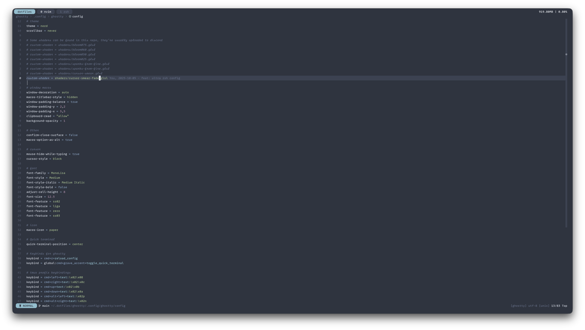

# .dotfiles

This is my dotfiles for MacOS.



## Setup

### Install
```
git clone --recursive git@github.com:H4ckint0sh/dotfiles.git ~/.dotfiles
cd ~/.dotfiles
chmod +x quickstart.sh
sh quickstart.sh
```
### Uninstall
Run `./cleanenv` to unlink the configs.

## Apps

- Text editor: [Neovim](https://neovim.io/)
- Terminal emulator: [wezterm](https://github.com/wez/wezterm)
- Terminal multiplexer: [tmux](https://github.com/tmux/tmux)
- Window manager: [aerospace](https://github.com/nikitabobko/AeroSpace)
- Git TUI: [lazygit](https://github.com/jesseduffield/lazygit)
- Shell: [zsh](https://www.zsh.org)
- Symlink manager: [stow](https://www.gnu.org/software/stow/)
- Better cat: [bat](https://github.com/sharkdp/bat)

